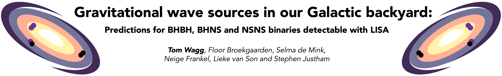

<p align="center">
    
</p>

<p align="center">
    <a href="https://zenodo.org/record/5651073">
        
    </a>
    <a href="https://zenodo.org/record/5178777">
        
    </a>
    <a href="https://zenodo.org/record/5189849">
        
    </a>
    <a href="https://doi.org/10.5281/zenodo.4699712">
        
    </a>
    <br>
    <a href="https://github.com/TomWagg/detecting-DCOs-in-LISA/raw/main/paper/tex/paper.pdf">
        
    </a>
    <a href="mailto:tomjwagg@gmail.com">
        
    </a>
</p>

<p align="center">
    This repository is a companion to Wagg et al. (2021), a paper investigating the Galactic population of LISA detectable BH and NS binaries. We discuss the expected detection rate, variations when using different underlying binary physics assumptions, prospects for identifying the sources of signals and matching them to electromagnetic counterparts.
</p>
<p align="center">
    This repository contains all of the code associated with with Wagg et al. (2021), both for the simulations so that you can reproduce the results, but also for the paper so that you can reproduce all of the plots. If you've come this far without reading the paper yet, I recommend that you go and take a look before trying to see what's going on in the code so it makes more sense.
</p>

<p align="center">
    If you have any questions about how to use any part of this repository please reach out via email at <a href="mailto:tomjwagg@gmail.com">tomjwagg@gmail.com</a>!
</p>

## Table of contents
- [Citations](#citations)
- [Required dependencies](#required-dependencies)
    - [Installing using Conda (recommended)](#installing-using-conda-recommended)
    - [Installing using pip](#installing-using-pip)
- [Required data](#required-data)
- [Using this repository](#using-this-repository)
    - [How to reproduce/adapt figures from the paper](#how-to-reproduceadapt-figures-from-the-paper)
    - [How to reproduce results/run a new simulation](#how-to-reproduce-resultsrun-a-new-simulation)
    - [Milky Way Model code](#milky-way-model-code)
    - [Colour Schemes](#colour-schemes)
- [Repository map](#repository-map)

<hr style="border-width:5px">

## Citations
If you use any figures, code or results from this paper we ask that you please cite Wagg et al. (2021). For convenience, here is link to the [ArXiv](TODO) and [ADS](TODO). Additionally, here is the bibtex entry:
```
    ADD BIBTEX ENTRY ONCE SUBMITTED (also need to fix links above)
```
## Required dependencies
This code makes heavy use of [LEGWORK](https://legwork.readthedocs.io/en/latest/), a Python package for determining the detectability of stellar-mass LISA sources that I wrote with Katie Breivik. It allows you evolve the orbits of binary sources, measure their strain and SNR as well as visualise the results.

We also use some more well known Python packages and list them below
- `numpy`
- `astropy`
- `scipy`
- `seaborn`
- `h5py`
- `matplotlib`
- `jupyter`
- `ipython`

### Installing using Conda (recommended)
You can install these packages using `conda` and create an environment for working with this code. Run the following to do so
```bash
conda create -n LISA_dcos numpy astropy scipy seaborn h5py matplotlib legwork jupyter ipython
conda activate LISA_dcos
```

### Installing using pip
If you don't have Anaconda then alternatively you can use pip to install everything by running
```bash
pip install numpy astropy scipy seaborn h5py matplotlib legwork jupyter ipython
```
## Required data
All data related to the predictions in the paper is stored [here](https://zenodo.org/record/4699713) on Zenodo. You'll need to download all of this data for reproducing the figures and be sure to follow the instructions on Zenodo for placing the data in the right place. If you also want to run a new simulation then you'll need the data from Broekgaarden et al. (2021, in prep.) which you can download [here](https://zenodo.org/record/5651073), [here](https://zenodo.org/record/5178777) and [here](https://zenodo.org/record/5189849) for BHBHs, BHNSs and NSNSs respectively.

## Using this repository
This repository is set up so that it is very easy not only to reproduce every result and figure in the paper but also adapt the work for future studies. With this in mind, let's split into two sections depending on whether you just want to visualise the results differently or whether you want to produce new results entirely.

### How to reproduce/adapt figures from the paper
Here's a quick guide on how you can reproduce any figure from the paper, as well as how to adapt those figures for your own use. First, clone the repository to your local machine to access all of the code. Next, for the majority of the figures in the paper you'll need to download the data by following the instructions on [Zenodo](https://zenodo.org/record/4699713). Once you've downloaded the data and put it in the right folder (`simulation/data`), you're ready to start making figures!

You're welcome to peruse the notebooks directly here on GitHub if you want to take a look at everything...but if you're looking for a particular figure then I recommend that you check the caption in the paper. There will be a small book symbol that links directly to the notebook that creates it. For example, let's consider [Figure 9](paper/figures/fig9_dco_detections.pdf) and say you wanted to only include the NSNS panel instead over DCO type. In this case, you need to open [this notebook](paper/figure_notebooks/detections.ipynb), which is linked in Figure 9's caption, and edit the code to remove the loop over DCO types so that you plot only the NSNSs instead.

In this same way you can pick any figure and follow the link in the caption to find a related notebook that will explain how to make the figure with commented code that you can edit.

Please remember to cite Wagg et al. (2021) should you use any figure/adapted figure in any public setting (papers/talks etc.). Thanks!
### How to reproduce results/run a new simulation
Reproducing the results from the paper should be just as easy as reproducing figures and adapting the simulations should also be very possible. Here are the steps you need to go through to run your very own simulation

#### General steps to take

1. Clone the repository to your machine
2. Ensure you have the [required dependencies installed](#required-dependencies)
3. [Download the data](#required-data) from both this paper and Broekgaarden et al. (2021)
4. (optional) Open [`simulation/src/simulate_DCO_detections.py`](simulation/src/simulate_DCO_detections.py) and make and edits to the simulation that you want to
5. Run `simulate_DCO_detections.py` to run a simulation! Run `python simulate_DCO_detections.py -h` to get usage instructions if you need them.

#### Example use case
Let's consider an example just to make sure everything is clear. Let's say that you were interested in how the detectable BHNSs are affected by both reducing the kicks from CCSN and assuming optimistic CE scenario (combining models K and Q) for a 10-year LISA mission. In this case, you could run a new simulation to find out!! In order to just run a single Milky Way instance you would run the following (from the simulation/src directory)
```bash
    python simulate_DCO_detections.py -i path/to/broekgaarden2021data/ccSNkick_30km_s/COMPASOutputCombined.h5 -o ../output/optimistic_plus_low_kicks.h5 -n 1 -t BHNS --opt-flag --extended-mission
```
In this line we've done a couple of things with the various command-line options:
- Set the input file to the correct data file from Broekgaarden et al. (2021)
- Set the output file to a sensible name in the output folder
- Only run a single MW instance
- Only run the simulation for BHNSs
- Turned on the optimistic CE flag
- Switched to an extended (10-year) LISA mission

And that is all you need to do to produce a simulation based on your new model!!

Of course, if you wanted to build up a proper statistical sample you'll need much more than a single Milky Way instance. For the paper, we ran 2500 Milky Way instances with 100,000 systems of each DCO type in each. You're welcome to edit the size of the Milky Way also within the simulation but we found that 100,000 provided a good number of detections to keep uncertainties low. You may also find that the `simulation/slurm` folder is useful for getting some of the setup for running these simulations on a computing cluster.

### Milky Way Model code
Want to use our Milky Way model in your work without coding it yourself? You're in luck, the `simulate_mw()` function in [simulation/src/galaxy.py](simulation/src/galaxy.py) will do exactly this. If you're interested in exploring the galaxy model in more detail I recommend you check out the [Galaxy Creation Station](paper/figure_notebooks/galaxy_creation_station.ipynb).

### Colour schemes
In case you're interested in using my colour schemes for the physics variations or formation channels:
- The colours used for each physics variation (as well as labels/descriptions) are contained in [simulation/src/variations.py](simulation/src/variations.py)
- The colours for the formation channels are defined in the formation channels notebook which can be found in [paper/figure_notebooks/formation_channels.ipynb](paper/figure_notebooks/formation_channels.ipynb)

## Repository map
Not sure where to look? This map should help point you to the right folder!

```
detecting-DCOs-with-LISA
│
└── paper
│   │   This folder contains everything to do with the paper
│   │    
│   │   `previous_BH_NS_studies.xlsx` has the comparison of previous studies with ours
│   └─── figure_notebooks
│   |    |   Jupyter notebooks that reproduce every figure in the paper
│   │
│   └─── figures
│   │    │   A collection of every figure used in the paper
│   │    └─── extra_figures
│   │         │ Some figures that didn't make it into the paper but that are still interesting!
│   │    
│   └─── tex
│        │   All of the LaTeX files for the paper (split up by section)
│    
│   
└─── simulation
    │
    └─── data
    │    │   This is the folder where most of the code assumes the data from Zenodo is stored
    │    │
    └─── postprocessing_notebooks
    │    │   Jupyter notebooks that transform the direct simulation output into more usable formats
    │    │
    └─── output
    │    │   Where the simulation puts all of its output on completion
    │    │
    └─── slurm
    │    │   SLURM commands for running cluster jobs on the Harvard cluster
    │    │
    └─── src
         │   Main simulation code
```
